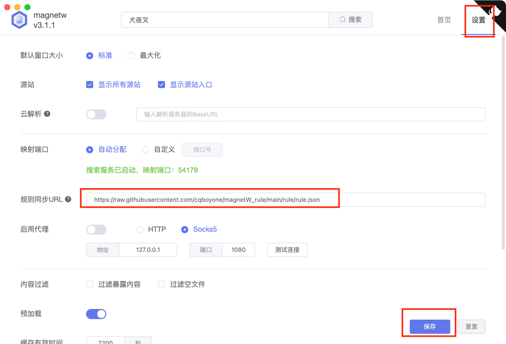

# magnetW_rule
借鉴了一下https://github.com/cqboyone/magnetW_rule 的一些规则
加入了一些自己搜集的规则

## 使用方法
1. 在 [magnetW](https://github.com/xiandanin/magnetW) 官方项目下载并安装
2. 在设置中的规则同步URL 填入该地址
`https://raw.githubusercontent.com/xhpk/magnetW_rule/main/rule/rule.json`

3. 打开自定义自定义UserAgent并填入
`Mozilla/5.0 (Windows NT 10.0; Win64; x64) AppleWebKit/537.36 (KHTML, like Gecko) Chrome/100.0.4896.75 Safari/537.36`

4.打开请求表示

5.保存，刷新

